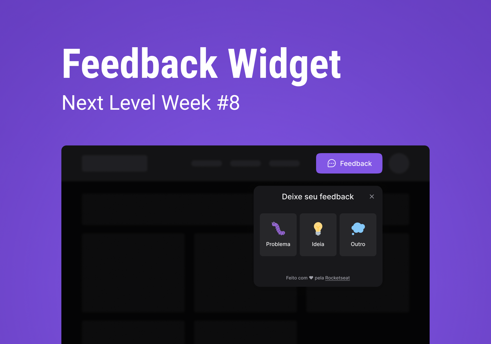

<h3 align="center">
  🚀 NLW #08 RETURNS 🚀
</h3>

  

## 🏃‍♂️Jornada

A NLW Return é a oitava edição do NLW com o objetivo de preparar nós, desenvolvedores, para disputar as melhores vagas no mercado de trabalho
com uma semana de muito conteúdo, ensinamentos, aprendizados e muito código.

Nesta edição vamos construir juntos uma aplicação que pode ser adicionada em um site ou em algum serviço web para fornecer feedback de forma simples e elegante.
Além disso será construído também um backend em NodeJS que será consumido por nossa aplicação ReactJS e nosso App com React Native.

### Stage 1 -> A aplicação será revelada [02/05/2022]

Neste dia foi apresentada a aplicação e o seu Design no [Figma](https://www.figma.com/community/file/1102912516166573468) feito por Ilana Mallak.

Iniciamos a aplicação usando [Vite](https://vitejs.dev/) que é uma alternativa ao CRA muito mais perfomático e otimizado para aplicações
modernas com as tecnologias que os Browsers já suportam. Na construção com React usamos [Tailwind CSS](https://tailwindcss.com/) para trabalhar a estilização
da nossa aplicação e dar um ar de elegância para ela através desse framework, usamos também [Headless UI](https://headlessui.dev/) para dar acessibilidade
de forma fácil e sem burocracia para nosso widget e, por último, aprendemos vários conceitos de acessibilidade, componentes, propriedades, estado e muito mais.

### Stage 2 -> Aceleração máxima [03/05/2022]

Na Stage 2 foi onde não só botamos a mão na massa como também exercitamos toda nossa lógica e nosso conhecimento para implementar, junto com o Diego Fernandes,
o formulário do nosso widget de feedback.

Passamos por conceitos mais aprofundados de estados, passagem de parâmetros para componentes filhos, passagem de parâmetros para componentes pai e quando é
a hora certa de dividir responsabilidades e código entre um ou mais arquivos. Isso é muito importante, pois nos torna mais críticos para pensarmos se um componente
está mesmo realizando aquilo que ele tem que realizar ou está tendo responsabilidades demais.

Aprendemos também a tirar um Screenshot da tela usando o html2canvas e como animar ícones com o Tailwind CSS de forma muito fácil e prática.

Fizemos a seção de feedback enviado, mas a implementação na prática com o envio para o backend se comunicando com nossa API será feita no Stage 3 onde iremos contruir
com as melhores práticas e usando testes nossa API para comunicação com a WEB e com o APP React Native.
